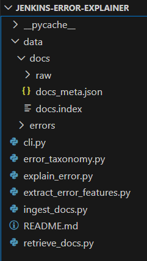

# Jenkins Error Explainer

A documentation-grounded system that explains Jenkins pipeline errors using official Jenkins documentation.

This project analyzes raw Jenkins build logs, extracts structured error signals, retrieves relevant documentation sections, and generates clear, human-readable explanations without relying on supervised training data.

---

## Motivation

Jenkins error logs are often verbose, difficult to interpret, and highly contextual.  
There is no standardized dataset of Jenkins errors or canonical explanations.

This project addresses that gap by:
- Using heuristic-based error feature extraction
- Grounding explanations strictly in official Jenkins documentation
- Avoiding hallucinated or unsafe advice

---

## What This Project Does

Given a Jenkins pipeline error log, the system:
1. Extracts key error signals (syntax errors, missing agents, missing plugins, etc.)
2. Retrieves relevant sections from Jenkins documentation
3. Generates a structured explanation including:
   - Error summary
   - Likely causes
   - Links to official documentation

---

## What This Project Does NOT Do

- Does not train or fine-tune a language model
- Does not rely on labeled error datasets
- Does not scrape community forums or StackOverflow

---

## Project Structure

## Error Categories Covered

- Pipeline syntax errors (invalid Groovy, missing braces)
- Missing agent or unavailable nodes
- Missing plugins / undefined DSL methods
- Missing credentials
- Workspace and file system errors
- Git / SCM authentication failures during checkout

---

## Model Usage

This project does not train or fine-tune any machine learning models.

Pre-trained sentence embedding models are used solely for semantic retrieval
over Jenkins documentation. No Jenkins error logs are used for training.

This design avoids the need for labeled datasets and ensures predictable,
reproducible behavior.

---
## Example

**Input:**  
Raw Jenkins console output containing a groovy syntax error.

**Output:**
Error Category:
groovy_syntax_error

Error Summary:
The pipeline failed due to a Groovy syntax error, most likely caused by an invalid or incomplete Jenkinsfile.

Likely Causes:
- Missing or mismatched braces in the Jenkinsfile
- Invalid declarative pipeline structure

Relevant Documentation:
- pipeline_syntax.txt (https://www.jenkins.io/doc/)
- using_a_jenkinsfile.txt (https://www.jenkins.io/doc/)
- using_a_jenkinsfile.txt (https://www.jenkins.io/doc/)
- using_a_jenkinsfile.txt (https://www.jenkins.io/doc/)
- using_a_jenkinsfile.txt (https://www.jenkins.io/doc/)

## Design Principles

- Documentation-first retrieval (RAG)
- Heuristic-driven error understanding
- Explicit handling of uncertainty
- Reproducible and explainable behavior

---

## Future Extensions

- Jenkinsfile explanation support
- Plugin-aware error analysis
- CLI or web-based interface
- Version-aware documentation indexing

---

## Guarantees and Limitations

This tool does NOT act as a general-purpose AI assistant.

Guarantees:
- Explanations are grounded in official Jenkins documentation only.
- Error classification is deterministic and rule-based.
- If relevant documentation is not found, the tool explicitly reports uncertainty.

Limitations:
- The tool does not attempt to fix errors automatically.
- It does not infer causes beyond documented Jenkins behavior.
- Unknown or plugin-specific errors may be reported as unsupported.

---

## Disclaimer

This project is an independent personal project and is not affiliated with or endorsed by the Jenkins project.

